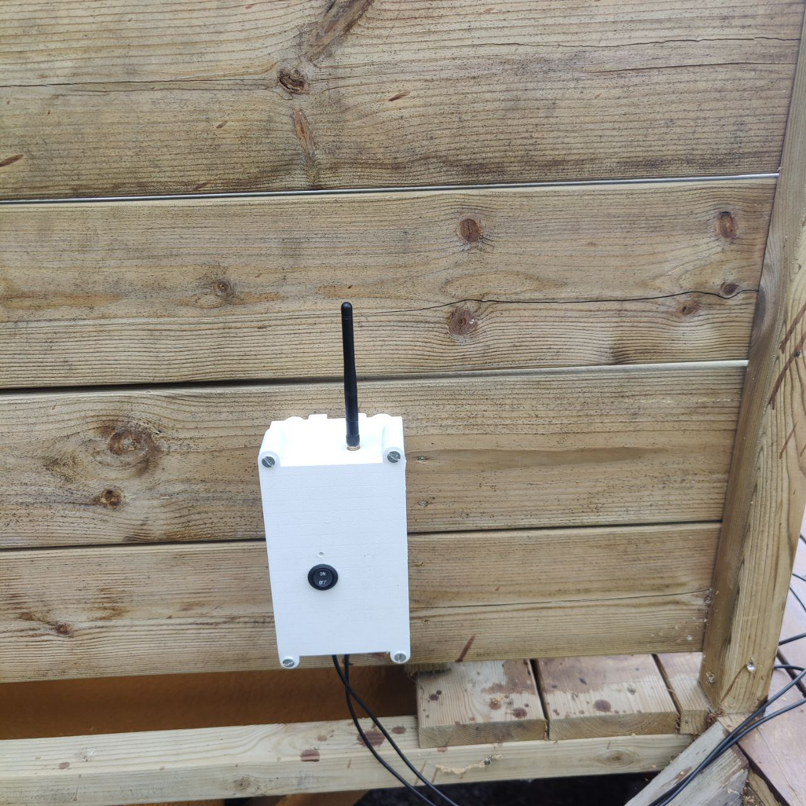
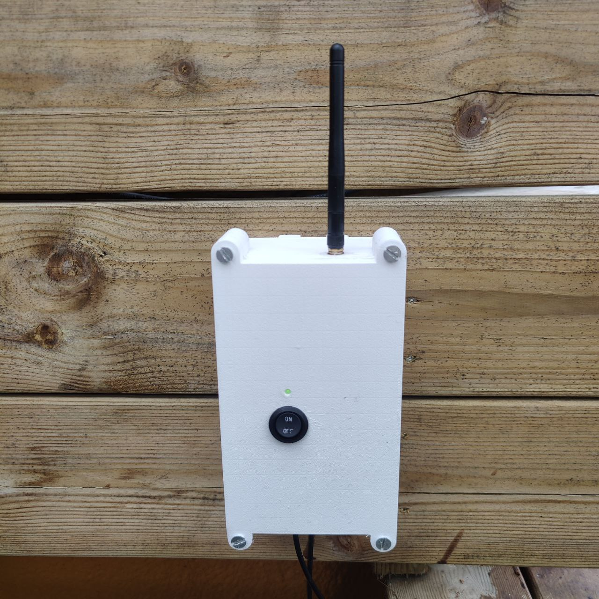
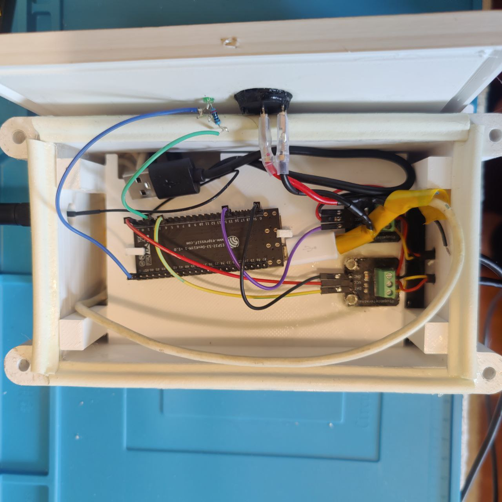
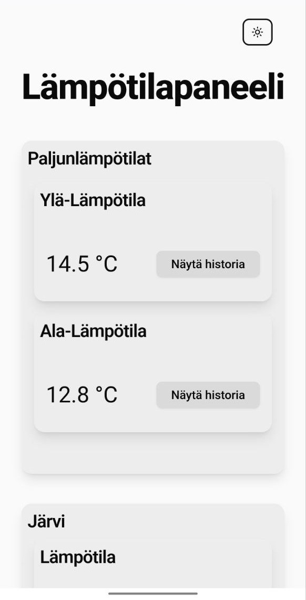
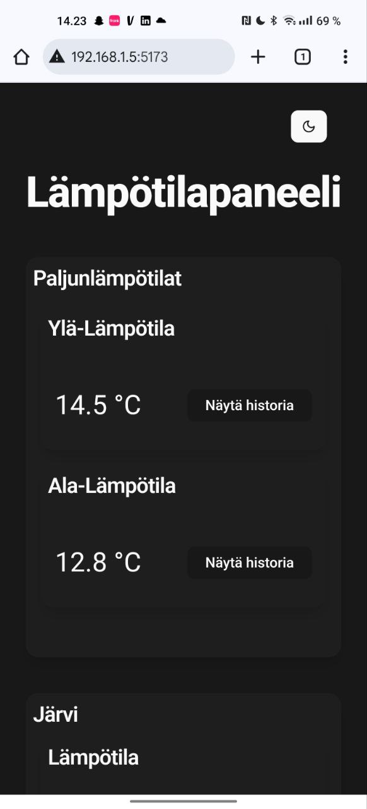
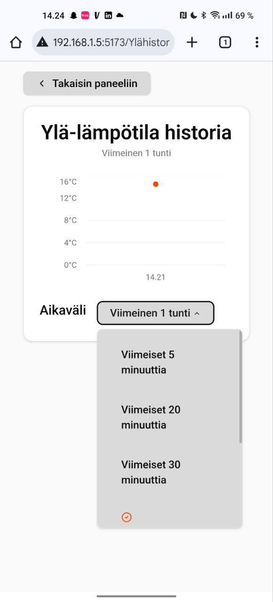
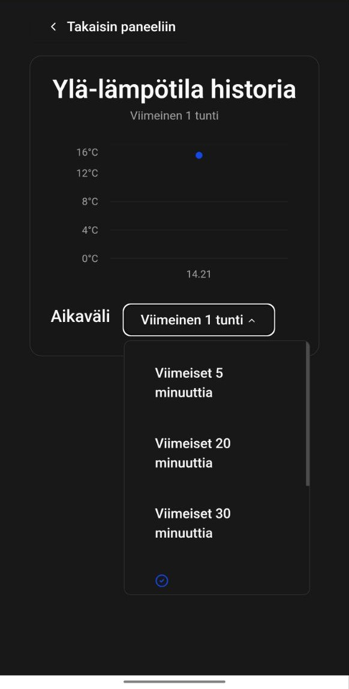
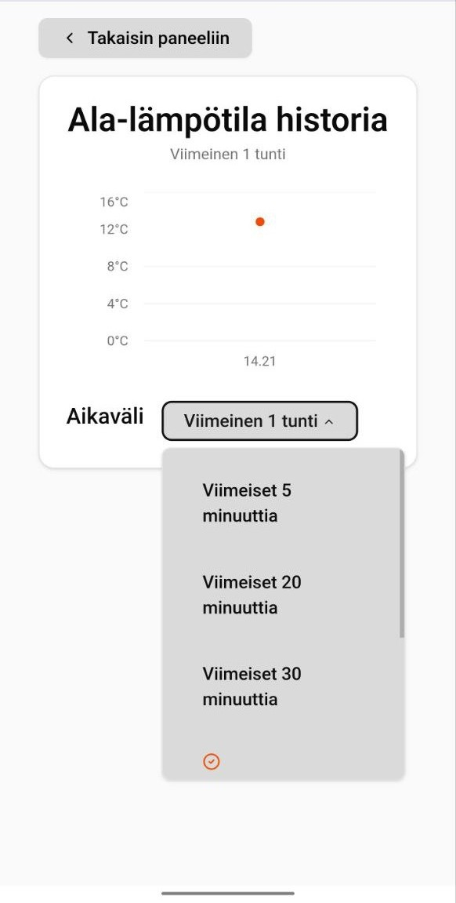
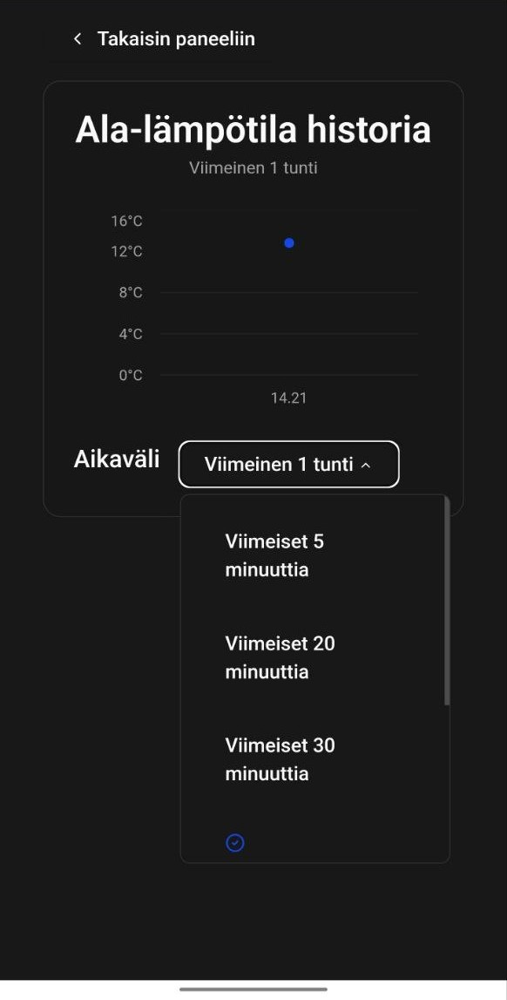

# TempTrack-IoT 

IoT temperature monitoring system with ESP32 sensor nodes sending data to a Flask backend on a Raspberry Pi 5. A React + Vite + Tailwind + ShadCN dashboard displays real-time and historical readings on any device in the local network.

---
## 📸 Hardware Photos

### Outside View
Here’s the waterproof enclosure fully assembled:

 

---

### Inside View
The inside shows the ESP32, wiring, and power bank setup:




---

### Homepage (Light & Dark Mode)
<div style="display: flex; gap: 10px;">
  
  
</div>

---
### History – Upper Sensor (Light & Dark Mode)
<div style="display: flex; gap: 10px;">
  
  
</div>

---

### History – Lower Sensor (Light & Dark Mode)
<div style="display: flex; gap: 10px;">
  
  
</div>

---
### 🌟 Why I Built This
I wanted a **smart, reliable way to monitor hot tub water temperature** for my family’s house, while also experimenting with **IoT hardware, APIs, and full-stack web apps**.  
The goal was to have both **upper and lower water temperatures** logged continuously, with real-time access on any device in our local network.  

---
### 🚀 What I Did
- Designed and assembled waterproof ESP32 sensor units  
- Implemented temperature readings with DS18B20 probes  
- Built a Flask backend API for collecting and serving data  
- Developed a React + Tailwind + ShadCN dashboard with live charts  
- Automated backend + frontend startup on Raspberry Pi with systemd  

---

### 🛠️ Tech Stack

- **ESP32 / PlatformIO** – Sensor nodes and firmware  
- **Flask (Python)** – Backend API server  
- **React + Vite + TailwindCSS + ShadCN** – Frontend dashboard  
- **Raspberry Pi 5** – Local server and dashboard hosting  

---
### 🔧 System Architecture
The project is split into three layers:  

1. **ESP32 Sensor Nodes** → Collect water temperature and send JSON data over WiFi  
2. **Flask Backend (Raspberry Pi 5)** → Receives + stores data from sensors  
3. **React Dashboard** → Displays real-time + historical temperature data  

---
### 🛠️ Hardware
**Outside Unit**
- ESP32-S3-DevkitM-1U  
- DS18B20 digital temperature sensors (two for hot tub, one for lake)  
- 20,000 mAh power bank  
- DS18B20 resistor module with 4.7 kΩ pull-up  
- Indicator LED + switch  
- Waterproof sealing tape + epoxy  

**Inside Unit**
- Raspberry Pi 5  
- Active cooler + 27W USB-C power supply  

### 🖥️ Development Process
1. Prototyped ESP32 firmware with Dallas Temperature library  
2. Built Flask backend with JSON endpoints  
3. Designed dashboard UI in [Figma](https://www.figma.com/design/TWQNi1zcBEpw2G51kZiim7/Paljuproject?node-id=0-1&m=dev)  
4. Implemented responsive React frontend with charts  
5. Integrated backend ↔ frontend  
6. Automated startup with systemd services  
7. Waterproofed & assembled outdoor unit  

---

### 💡 Setup Instructions

### 1️⃣ ESP32 Sensor Nodes (PlatformIO / Arduino)

1. Open the PlatformIO project in VSCode  
2. Connect your ESP32 device  
3. Configure `src/main.cpp` with your WiFi credentials and backend URL  
4. Flash the firmware to the ESP32  

---
### 2️⃣ Backend (Flask / Raspberry Pi 5)
⚠️ Important: Assign a static IP to your Raspberry Pi 5 that doesn’t conflict with other devices on your network. You can check your router’s DHCP range (usually accessible via your router’s gateway login) and pick an IP outside that range.
1. Install Python 3.x on your Raspberry Pi 5  
2. Clone the repository:  
   ```bash
   git clone https://github.com/PetteriSuonpaa/TempTrack-IoT.git
   cd TempTrack-IoT/server
3. Create a virtual environment and activate it:
   ```bash
   python3 -m venv venv
   source venv/bin/activate
4. Install dependencies:
   ```bash
   pip install -r requirements.txt
5. Run the server:
   ```bash
    python run.py

---

### 3️⃣ Frontend (React + Vite + Tailwind + ShadCN)

1. Navigate to the frontend folder:
   ```bash
   cd ../frontend
2. Install dependencies:  
   ```bash
   npm install
3. Run the development server:
   ```bash
   npm run dev
4. Open your browser at:
   ```text
   http://<RaspberryPi_IP>:5173
---

### 4️⃣ Automate Backend & Frontend on Boot

To start both backend and frontend automatically on Raspberry Pi boot, use **systemd services**.

#### a) Backend Service

Create the service file:
  ```bash
    sudo nano /etc/systemd/system/temptrack-backend.service
```
Add:
  ```ini
    [Unit]
    Description=TempTrack IoT Frontend (React)
    After=network.target temptrack-backend.service
    
    [Service]
    User=pi
    WorkingDirectory=/home/pi/TempTrack-IoT/frontend
    ExecStart=/usr/bin/npm run dev
    Restart=on-failure
    
    [Install]
    WantedBy=multi-user.target
```
Enable and start:
  ```bash
  sudo systemctl enable temptrack-backend
  sudo systemctl start temptrack-backend
  sudo systemctl status temptrack-backend
```
#### b) Frontend Service

Create the service file:
  ```bash
    sudo nano /etc/systemd/system/temptrack-frontend.service
```
Add:
  ```ini
    [Unit]
    Description=TempTrack IoT Frontend (React)
    After=network.target temptrack-backend.service
    
    [Service]
    User=pi
    WorkingDirectory=/home/pi/TempTrack-IoT/frontend
    ExecStart=/usr/bin/npm run dev
    Restart=on-failure
    
    [Install]
    WantedBy=multi-user.target
```
Enable and start:
  ```bash
  sudo systemctl enable temptrack-frontend
  sudo systemctl start temptrack-frontend
  sudo systemctl status temptrack-frontend
```
✅ Now both backend and frontend will automatically start on Raspberry Pi boot.

---

### Future Improvements 
- Enable secure remote access via VPN or tunneling  
- Design a custom PCB to reduce wiring clutter and save space in the enclosure  
- Improve power bank accessibility and charging convenience  
- Enhance the web dashboard design for an even more appealing and intuitive user experience

---
